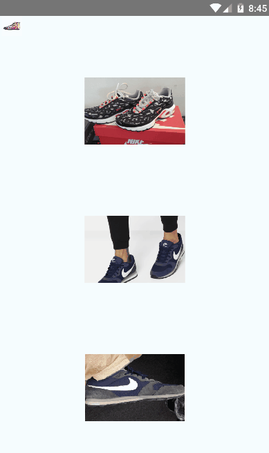

# Search Product Price with React Native via Tensorflow Lite 

Image classification with React-Native and searching this classified price of the product on the Internet.

# # Installation
download the project and run "npm i" in the project folder.

This client design was inspired by this [GITHUB repo](https://github.com/GantMan/RN_TF_Lite/tree/master/android).

Can't use quantized smaller model yet, due to [limitation in `react-native-tensorflow-lite`](https://github.com/jazzystring1/react-native-tensorflow-lite/issues/3), and project is currently Android ONLY with [aspirations for iOS support](https://github.com/jazzystring1/react-native-tensorflow-lite/issues/2).
